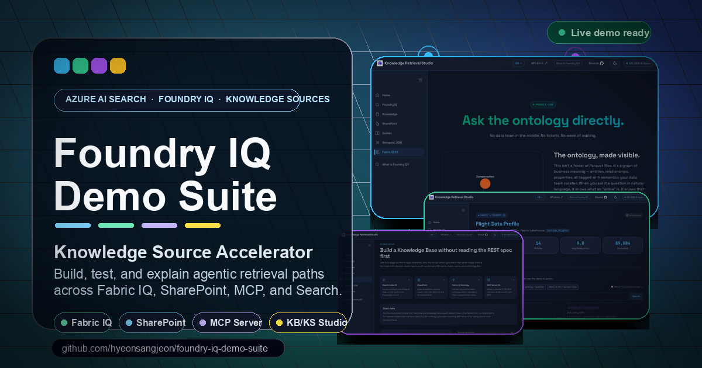
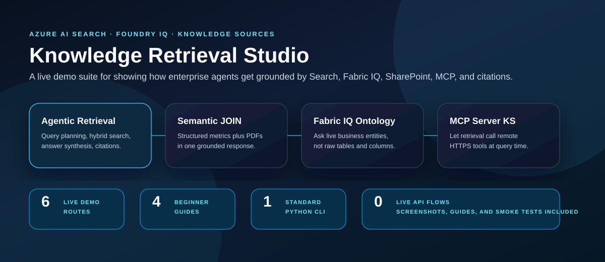
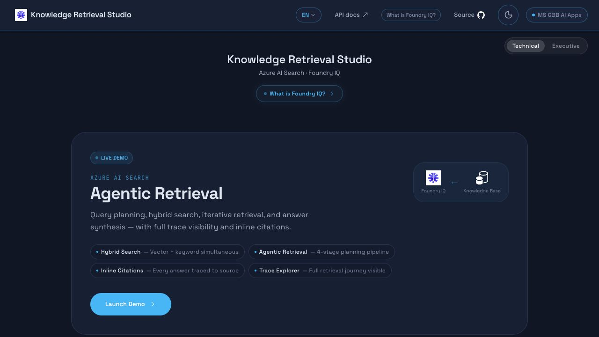
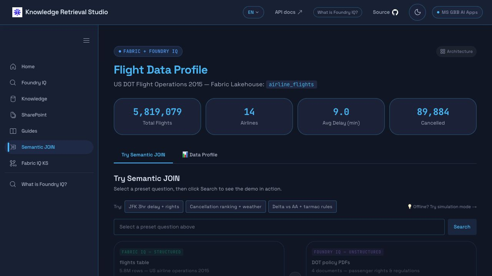
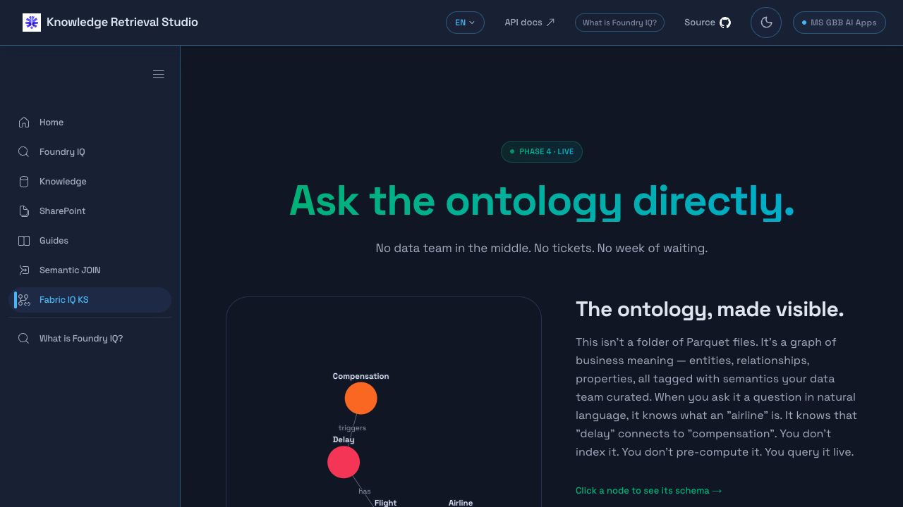
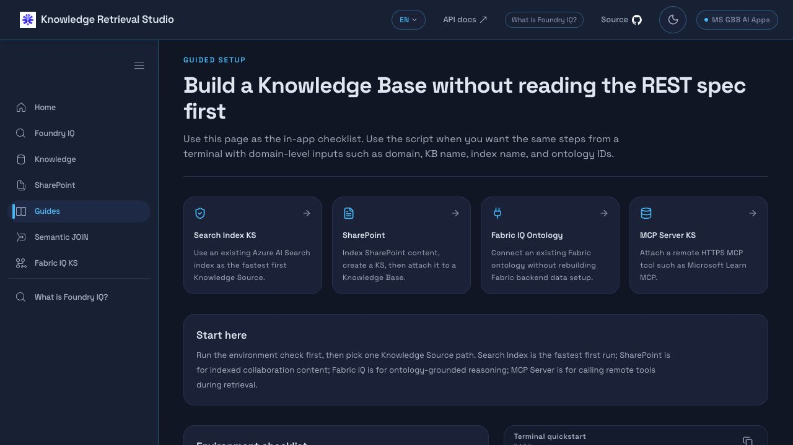
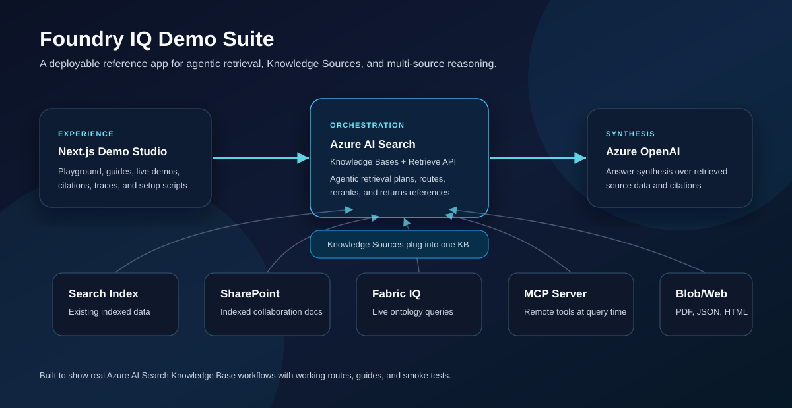
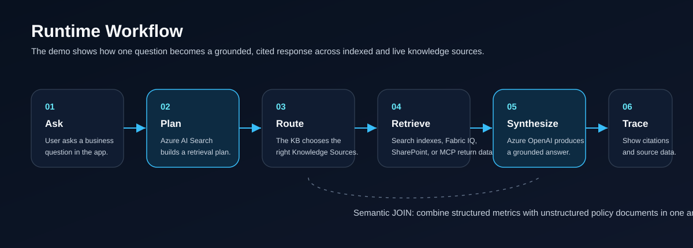

<p align="center">
  
</p>

<h1 align="center">Foundry IQ Demo Suite</h1>

<p align="center">
  <strong>A live Knowledge Retrieval Studio for Azure AI Search, Foundry IQ, Knowledge Sources, Semantic JOIN, Fabric IQ, SharePoint, and MCP Server grounding.</strong>
</p>

<p align="center">
  <a href="https://foundry-iq-demo-suite.vercel.app"></a>
  <a href="https://learn.microsoft.com/azure/search/"></a>
  <a href="https://nextjs.org/"></a>
  <a href="https://www.typescriptlang.org/"></a>
  <a href="https://github.com/hyeonsangjeon/foundry-iq-demo-suite/stargazers"></a>
</p>







## The 20-Second Pitch

Most agent demos stop at "chat with a PDF." This repo shows the enterprise retrieval pattern that actually matters:

1. A user asks one business question.
2. Azure AI Search plans retrieval through a Knowledge Base.
3. The Knowledge Base routes to the right Knowledge Sources.
4. Indexed Search, SharePoint, Fabric IQ ontology, Blob/PDF/JSON, or MCP Server tools return grounding data.
5. Azure OpenAI synthesizes an answer with citations and inspectable source data.

It is built to be shown live, forked locally, and reused as a practical reference app for agentic retrieval.

## What Makes This Repo Useful

- **Live app:** polished Next.js demo routes for Knowledge Bases, Knowledge Sources, SharePoint, Semantic JOIN, Fabric IQ, and MCP Server grounding.
- **Accelerator scripts:** seed a Search index, create Knowledge Sources, create Knowledge Bases, retrieve, and clean up from the terminal.
- **Beginner docs:** follow a narrow path from local JSON/JSONL/CSV data to a working KB before adding SharePoint, Fabric IQ, or MCP.
- **Demo assets:** screenshots, architecture diagrams, workflow diagrams, and scenario pages for customer-ready walkthroughs.
- **Real operational patterns:** multi-source grounding, citation inspection, source data panels, and retrieval workflow explanation.

## Live Knowledge Sources: Demo Here, Deploy from Microsoft

This suite is the visual, localized demo companion for MCP Server and Fabric Ontology Knowledge Sources. For a runnable end-to-end environment, start with Microsoft's official execution manual:

**[Live Knowledge Sources Manual](https://microsoft.github.io/azure-ai-search-foundry-iq-live-knowledge-sources/)**

The Microsoft manual and [source repository](https://github.com/microsoft/azure-ai-search-foundry-iq-live-knowledge-sources) own the deployment path: one-command setup, notebooks, REST requests, offline responses, environment checks, cleanup scripts, and the latest public-preview constraints. They also demonstrate one Knowledge Base routing across both live source types while returning inspectable `activity`, `references`, and `sourceData`.

| What you want to run | Official path | Use it for |
| --- | --- | --- |
| Choose the right starting mode | [Choose a pattern](https://microsoft.github.io/azure-ai-search-foundry-iq-live-knowledge-sources/02-choose-a-pattern/) | Pick `mcp-only`, `byo-fabric`, or `full` based on your tenant and existing Fabric assets. |
| Microsoft Learn over MCP | [MCP Server Knowledge Source](https://microsoft.github.io/azure-ai-search-foundry-iq-live-knowledge-sources/03-mcp-server-ks/) | Deploy an HTTPS MCP source with an explicit tool allowlist, output parsing, and retrieval-time grounding. |
| Fabric IQ business semantics | [Fabric Ontology Knowledge Source](https://microsoft.github.io/azure-ai-search-foundry-iq-live-knowledge-sources/04-fabric-ontology-ks/) | Connect a same-tenant Fabric workspace and ontology with end-user query-source authorization. |
| One KB across MCP + Fabric | [Combined Knowledge Base routing](https://microsoft.github.io/azure-ai-search-foundry-iq-live-knowledge-sources/05-combined-kb-routing/) | Route a question to fresh documentation, ontology-backed operational facts, or both. |
| Preview readiness and caveats | [Public-preview limitations](https://microsoft.github.io/azure-ai-search-foundry-iq-live-knowledge-sources/13-public-preview-limitations/) | Check runtime, identity, quota, region, and service limitations before a customer demo. |

Start with `mcp-only` for the fastest live deployment. Choose `byo-fabric` when the workspace and ontology already exist. Use `full` for a greenfield environment after checking quota, identity, and regional readiness. The official repo also includes a roughly 30-second offline replay path when Azure credentials are not available.

## Start From Data In Five Commands

The fastest path uses local JSONL data, creates a simple Azure AI Search index, attaches it as a Knowledge Source, creates a KB, and tests retrieval.

```bash
python scripts/foundry_iq_easy_setup.py check

python scripts/foundry_iq_seed_index.py \
  --domain airline \
  --index-name airline-demo-index \
  --data-file data/sample-knowledge-docs.jsonl \
  --replace

python scripts/foundry_iq_easy_setup.py create-search-index-ks \
  --domain airline \
  --ks-name airline-search-ks \
  --index-name airline-demo-index

python scripts/foundry_iq_easy_setup.py create-kb \
  --kb-name airline-demo-kb \
  --ks airline-search-ks \
  --model gpt-4o

python scripts/foundry_iq_easy_setup.py retrieve \
  --kb-name airline-demo-kb \
  --question "What should we do for an overnight controllable delay?" \
  --include-source-data
```

Full walkthrough: [Easy Data, Knowledge Source, and Knowledge Base Setup](docs/easy-ks-kb-setup.md).

## Why Teams Use It

| What you get | Why it matters |
| --- | --- |
| **A real app, not just snippets** | The repo includes a polished Next.js demo suite with deployed routes and reusable UI. |
| **Multi-source Knowledge Source coverage** | Search Index, SharePoint, Fabric IQ ontology, MCP Server, Blob/PDF/JSON, and Semantic JOIN patterns are represented. |
| **Customer-demo-ready screens** | The live app shows citations, source data, guide pages, scenario pages, and retrieval workflows. |
| **Beginner setup scripts** | Standard-library Python helpers seed data, create KS/KB resources, retrieve, delete, and support `--dry-run`. |
| **Smoke-tested workflow** | The live smoke test creates a temporary KS/KB, calls retrieve, and deletes both resources. |

## Demo Map

| Demo | Route | What to show |
| --- | --- | --- |
| Agentic Retrieval | [`/test`](https://foundry-iq-demo-suite.vercel.app/test) | KB retrieval, answer synthesis, references, and trace-style inspection. |
| Knowledge Management | [`/knowledge`](https://foundry-iq-demo-suite.vercel.app/knowledge) | Knowledge Bases and Knowledge Sources as manageable Azure AI Search resources. |
| SharePoint Connector | [`/sharepoint`](https://foundry-iq-demo-suite.vercel.app/sharepoint) | Enterprise content discovery, indexing, KS creation, and KB verification. |
| Semantic JOIN | [`/semantic-join`](https://foundry-iq-demo-suite.vercel.app/semantic-join) | Structured flight metrics joined with DOT policy PDFs in one grounded answer. |
| Fabric IQ Ontology KS | [`/fabric-iq-ks`](https://foundry-iq-demo-suite.vercel.app/fabric-iq-ks) | Ontology-aware reasoning over business entities instead of raw tables. |
| Microsoft Learn MCP KS | [`/mcp-ks`](https://foundry-iq-demo-suite.vercel.app/mcp-ks) | Five-language live retrieval, localized starter questions, references, and activity trace. |
| Guided Setup | [`/guides`](https://foundry-iq-demo-suite.vercel.app/guides) | Copyable steps for creating Knowledge Sources and Knowledge Bases. |

## Product Screens

| Semantic JOIN | Fabric IQ Ontology KS |
| --- | --- |
|  |  |

| Guided Setup | Landing Experience |
| --- | --- |
|  |  |

## Architecture



At runtime, the app calls Azure AI Search Knowledge Base APIs. A Knowledge Base references one or more Knowledge Sources. Each source can represent indexed data, enterprise documents, live ontology calls, or remote MCP tools. Azure OpenAI handles answer synthesis over the retrieved references.

## Runtime Workflow



The important idea is not only retrieval. It is **routing**. The retrieval layer decides which Knowledge Source should answer, then returns cited grounding data that the app can inspect.

## The Signature Scenario: Semantic JOIN

One customer-style question needs two kinds of evidence:

- **Structured data:** Fabric OneLake aggregated airline delay metrics.
- **Unstructured documents:** DOT regulation and policy PDFs.
- **One answer:** synthesized with citations from both sources.

That is the enterprise agent pattern this repo is designed to make obvious: curated operational data plus policy knowledge, joined at retrieval time.

Domain reference: the synthetic Airline Ops ontology map and validation contract are documented in [Airline Ops Ontology Contract](docs/airline-ops-ontology-contract.md). Use it when you want to inspect the SVG relationship map and the checks behind the Fabric IQ scenario.

## Knowledge Source Coverage

| Knowledge Source path | Included | Demo value |
| --- | --- | --- |
| `searchIndex` | Yes | Fastest path for existing Azure AI Search indexes. |
| Indexed SharePoint | Yes | Shows enterprise collaboration content as KB grounding. |
| Fabric IQ ontology | Yes | Live ontology queries through a Knowledge Source. |
| MCP Server | Yes | Remote HTTPS tools become retrieval-time grounding sources. |
| Blob / PDF / JSON | Yes | Baseline document and dataset grounding patterns. |
| Web URL | Pattern ready | Fits the same Knowledge Source model. |

## Guided Setup

The app and docs include guide pages that map directly to script commands:

- [`/guides/search-index`](https://foundry-iq-demo-suite.vercel.app/guides/search-index)
- [`/guides/sharepoint`](https://foundry-iq-demo-suite.vercel.app/guides/sharepoint)
- [`/guides/fabric-iq-ontology`](https://foundry-iq-demo-suite.vercel.app/guides/fabric-iq-ontology)
- [`/guides/mcp-server`](https://foundry-iq-demo-suite.vercel.app/guides/mcp-server)
- [Easy KS/KB setup doc](docs/easy-ks-kb-setup.md)

The helper scripts intentionally use only the Python standard library:

```bash
python scripts/foundry_iq_easy_setup.py check

python scripts/foundry_iq_seed_index.py \
  --domain airline \
  --index-name airline-demo-index \
  --data-file data/sample-knowledge-docs.jsonl \
  --dry-run

python scripts/foundry_iq_easy_setup.py create-search-index-ks \
  --domain airline \
  --ks-name airline-policy-ks \
  --index-name airline-policy-index \
  --dry-run

python scripts/foundry_iq_easy_setup.py create-kb \
  --kb-name airline-ops-kb \
  --ks airline-policy-ks \
  --model gpt-4o
```

Supported commands include `check`, `list-ks`, `list-kb`, `create-search-index-ks`, `create-fabric-ontology-ks`, `create-mcp-ks`, `create-kb`, `retrieve`, `delete-ks`, and `delete-kb`.

For data loading, use `scripts/foundry_iq_seed_index.py` with JSON, JSONL, or CSV.

## Quick Start

```bash
git clone https://github.com/hyeonsangjeon/foundry-iq-demo-suite.git
cd foundry-iq-demo-suite

cp .env.example .env.local
npm install
npm run dev
```

Open http://localhost:3000.

Minimum local environment:

```dotenv
AZURE_SEARCH_ENDPOINT=https://your-search.search.windows.net
AZURE_SEARCH_API_KEY=your-search-key
AZURE_SEARCH_API_VERSION=2025-11-01-preview
NEXT_PUBLIC_AZURE_OPENAI_ENDPOINT=https://your-openai.cognitiveservices.azure.com
```

RBAC mode:

```dotenv
AZURE_SEARCH_USE_RBAC=true
AZURE_TENANT_ID=your-tenant-id
AZURE_CLIENT_ID=your-service-principal-client-id
AZURE_CLIENT_SECRET=your-service-principal-secret
```

For full setup options, see [.env.example](.env.example).

## Validate Locally

```bash
npm run build
python3 -m unittest scripts/test_foundry_iq_easy_setup.py
python3 -m unittest scripts/test_foundry_iq_seed_index.py
python3 -m py_compile scripts/foundry_iq_easy_setup.py scripts/foundry_iq_seed_index.py scripts/foundry_iq_live_smoke_test.py
```

Live smoke test:

```bash
python3 scripts/foundry_iq_live_smoke_test.py --auth-mode api-key
```

The smoke test creates a temporary Knowledge Source and Knowledge Base, calls retrieve, and deletes both resources in a `finally` cleanup block.

## Project Structure

```text
app/
  test/                    # Agentic retrieval playground
  knowledge/               # Knowledge Base management
  sharepoint/              # SharePoint indexing and KS flow
  semantic-join/           # Structured + unstructured multi-source demo
  fabric-iq-ks/            # Fabric IQ ontology Knowledge Source demo
  mcp-ks/                  # Localized Microsoft Learn MCP live demo
  guides/                  # Beginner setup guides
  api/
    mcp-knowledge-source/  # Live MCP Knowledge Base retrieve route
    ...                    # Search, KB, SharePoint, and demo APIs
components/
  mcp-ks/                  # MCP query, response, citation, and trace UI
  guides/                  # Guide UI primitives
  ui/                      # Shared UI components
lib/                       # API clients, auth, i18n, utility logic
scripts/
  foundry_iq_easy_setup.py # KS/KB setup helper
  foundry_iq_seed_index.py # JSON/JSONL/CSV -> simple Search index
  foundry_iq_live_smoke_test.py
data/
  sample-knowledge-docs.jsonl # Tiny sample for first-run indexing
docs/
  easy-ks-kb-setup.md       # Data -> KS -> KB beginner walkthrough
public/readme/             # README screenshots and diagrams
```

## Tech Stack

- Next.js 14 App Router
- React 18 + TypeScript
- Tailwind CSS
- Azure AI Search Knowledge Bases and Knowledge Sources
- Azure OpenAI answer synthesis
- Vercel deployment
- Optional Azure Search RBAC via service principal

## Official Accelerator and Microsoft Docs

- [Live Knowledge Sources execution manual](https://microsoft.github.io/azure-ai-search-foundry-iq-live-knowledge-sources/)
- [Manual runbook](https://microsoft.github.io/azure-ai-search-foundry-iq-live-knowledge-sources/runbook/)
- [Notebook samples](https://microsoft.github.io/azure-ai-search-foundry-iq-live-knowledge-sources/samples/notebooks/)
- [REST samples](https://microsoft.github.io/azure-ai-search-foundry-iq-live-knowledge-sources/samples/rest/)
- [Microsoft live Knowledge Sources source repository](https://github.com/microsoft/azure-ai-search-foundry-iq-live-knowledge-sources)
- [Azure AI Search knowledge bases](https://learn.microsoft.com/rest/api/searchservice/knowledge-bases)
- [Create a Fabric Ontology knowledge source](https://learn.microsoft.com/azure/search/agentic-knowledge-source-how-to-fabric-ontology)
- [Create an MCP Server knowledge source](https://learn.microsoft.com/azure/search/agentic-knowledge-source-how-to-mcp-server)
- [What is Foundry IQ?](https://learn.microsoft.com/azure/foundry/agents/concepts/what-is-foundry-iq)
- [Foundry IQ FAQ](https://learn.microsoft.com/azure/foundry/agents/concepts/foundry-iq-faq)

## Lineage

Phase 1 builds on [farzad528/azure-ai-search-knowledge-retrieval-demo](https://github.com/farzad528/azure-ai-search-knowledge-retrieval-demo) under the MIT License.

## Author

**Hyeonsang Jeon** - Sr. Solution Engineer, Microsoft AI Global Black Belt

Built for technical demos, customer conversations, and hands-on exploration of Knowledge Sources and agentic retrieval.

## Support the Project

If this repo saved you demo preparation time or made Foundry IQ easier to explain, [star the repository](https://github.com/hyeonsangjeon/foundry-iq-demo-suite). It helps more builders find the examples and tells me which public demos are worth polishing next.
