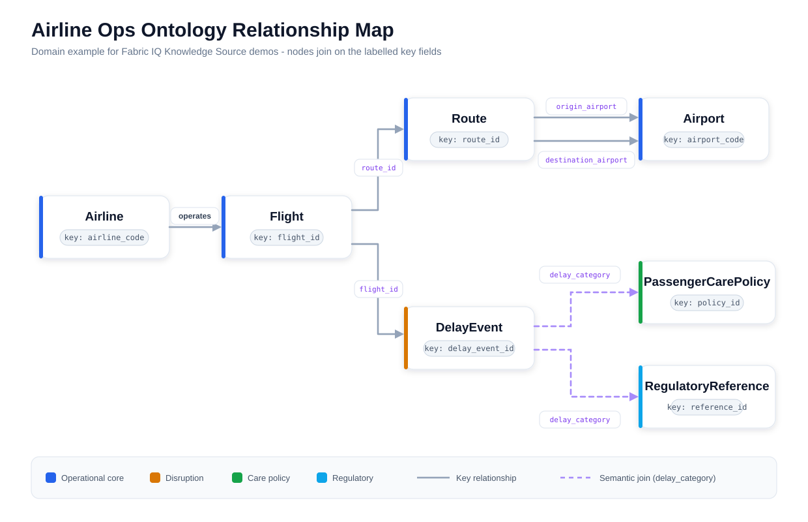

# Airline Ops Ontology Contract

This is the domain reference for the synthetic Airline Ops ontology used by the Fabric IQ Knowledge Source scenario.

The main README stays focused on Foundry IQ and Knowledge Sources. This page goes one layer deeper: it explains the SVG relationship map, the ontology shape, and the validation signals that make the demo credible.



## Purpose

The Airline Ops contract gives the demo a realistic business graph without using real airline performance data. It is useful when you need to explain how a Fabric ontology can expose governed business semantics to Azure AI Search Knowledge Bases.

Use it to reason about:

- Operational entities such as airlines, flights, routes, and airports.
- Disruption details such as delay events and controllability.
- Policy and regulatory context joined through delay category and trigger conditions.
- Validation questions that prove the ontology can answer cross-entity questions.

## Reading The SVG

The SVG is the compact contract for the ontology:

- Blue nodes are the operational core: `Airline`, `Flight`, `Route`, and `Airport`.
- Amber is the disruption event: `DelayEvent`.
- Green and cyan are governance context: `PassengerCarePolicy` and `RegulatoryReference`.
- Solid gray arrows are key relationships between operational entities.
- Dashed purple arrows are semantic joins from `DelayEvent.delay_category` into policy and regulatory reference data.

The important part is not the diagram styling. It is the labelled join fields. Those labels show exactly how a Fabric ontology can expose governed relationships to an Azure AI Search Knowledge Source so the agent can answer cross-entity questions without guessing table joins from raw text.

## Entity Map

| Entity | Primary key | Role in the sample |
| --- | --- | --- |
| `Airline` | `airline_code` | Carrier-level business entity with region, alliance, and care tier. |
| `Airport` | `airport_code` | Origin, destination, and hub context for routes. |
| `Route` | `route_id` | Origin-destination market with distance and market type. |
| `Flight` | `flight_id` | Operational flight record with schedule, actual timing, and delay state. |
| `DelayEvent` | `delay_event_id` | Delay cause, controllability, exposure, and disruption summary. |
| `PassengerCarePolicy` | `policy_id` | Care actions that apply to delay categories and trigger conditions. |
| `RegulatoryReference` | `reference_id` | Carrier-neutral regulatory or policy references for disruption scenarios. |

## Relationship Contract

The SVG highlights the join fields because those fields are what make the ontology useful for retrieval-time grounding.

| Relationship | Join |
| --- | --- |
| Airline operates Flight | `Airline.airline_code -> Flight.airline_code` |
| Route has origin Airport | `Route.origin_airport_code -> Airport.airport_code` |
| Route has destination Airport | `Route.destination_airport_code -> Airport.airport_code` |
| Flight uses Route | `Flight.route_id -> Route.route_id` |
| Flight has DelayEvent | `Flight.flight_id -> DelayEvent.flight_id` |
| DelayEvent matches PassengerCarePolicy | `DelayEvent.delay_category -> PassengerCarePolicy.applicable_delay_category` |
| DelayEvent matches RegulatoryReference | `DelayEvent.delay_category -> RegulatoryReference.applicable_delay_category` |

The last two relationships are semantic joins. They are intentionally category- and trigger-driven rather than airline-name-driven. That makes the example better for enterprise demos because policy and regulatory guidance should not depend on literal carrier names appearing in the source text.

## Expected Validation Signals

These counts are small on purpose. The sample is designed for quick validation, not scale testing.

| Signal | Expected value |
| --- | ---: |
| Airlines | 5 |
| Airports | 8 |
| Routes | 8 |
| Flights | 15 |
| Delayed flights over 15 minutes | 10 |
| Delay events | 10 |
| Passenger-care policies | 4 |
| Regulatory references | 4 |
| Customer-care exposure | 15,800 USD |

The top customer-care exposure carrier in the synthetic data is `Alpine Air`.

## Questions This Ontology Should Support

Use these questions as acceptance checks before connecting the Fabric ontology to a Knowledge Source:

- Which airlines have the highest customer-care exposure this month?
- Which routes have the most delayed flights over 15 minutes?
- Which delay categories are controllable and driving customer-care exposure?
- Which passenger-care policies or regulation topics explain the risk for the highest-exposure airline?
- List delayed flights from the transcontinental market and explain the related route and airline.

## How It Fits Foundry IQ

In this repo, the ontology contract is not the main product surface. It is the domain example behind the Fabric IQ Knowledge Source story:

```text
Fabric ontology
  -> Azure AI Search Fabric IQ Knowledge Source
  -> Knowledge Base routing
  -> grounded answer with references and source data
```

The key teaching point is that Knowledge Sources can ground answers in curated business semantics instead of forcing the agent to infer relationships from raw tables or copied documentation.

## Boundary

This is a public-demo contract:

- Fictional carrier names are used.
- Counts are intentionally small and deterministic.
- The map is not a production ontology recommendation.
- Fabric workspace, Lakehouse, ontology, and data-agent provisioning are separate upstream setup tasks.

For the app-level Fabric IQ demo, start with [`/fabric-iq-ks`](https://foundry-iq-demo-suite.vercel.app/fabric-iq-ks).
