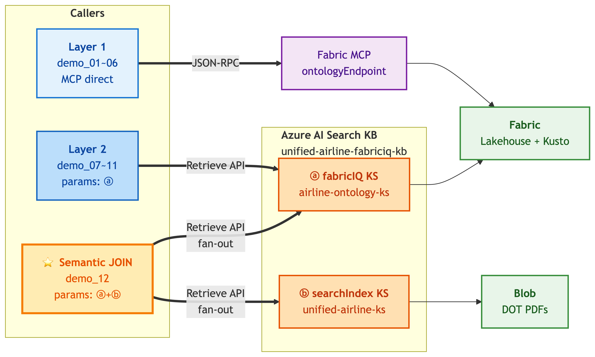
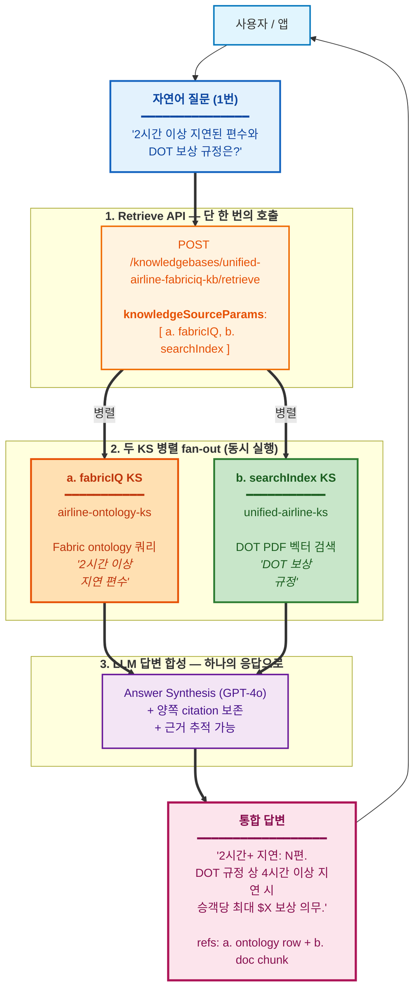

# Fabric IQ Ontology × Foundry IQ — 데모 팩

> **버전**: v1.0 — 2026-04-23 (Korea STU CAIP Hands-on)
> **공개 범위**: Microsoft 내부 (Korea GBB 채널)
> **작성**: Hyeonsang Jeon — Global Black Belt, AI Apps Sr. Solution Engineer (`hjeon@microsoft.com`)

**목적**: Korea STU CAIP Hands-on (4/23) — Microsoft Fabric ontology를 **두 가지 경로**로 질의하는 라이브 데모. (1) Fabric IQ MCP 엔드포인트 직접 호출 (Layer 1), (2) Foundry IQ Retrieve API + `kind: fabricIQ` Knowledge Source 경유 (Layer 2).

**대상**: Korea STU 실무자, 참관자

**형식**: 라이브 화면 공유 데모. 참석자는 우리 테넌트에 직접 호출하지 않음.

> 영문 원본: [README.md](./README.md)
> 상세 가이드 (한국어): [`../guide-ko.md`](../guide-ko.md)

---

## 무엇을 보여주는가

이 팩은 같은 Fabric ontology 데이터에 대한 **두 가지 경로**를 시연한다:

- **Layer 1 — MCP 직접 호출** (`scripts/demo_01~06`): Fabric IQ Ontology MCP 엔드포인트로 raw JSON-RPC POST. 두 개의 tool (`list_ontology_entity_types`, `search_ontology`) 노출.
- **Layer 2 — Foundry IQ KS 경로** (`scripts/demo_07~11`): 같은 NL 질의를 (이제 우리 *"airline ontology"* 로 **스코프**) Azure AI Search의 Foundry IQ Retrieve API로 라우팅. KB `unified-airline-fabriciq-kb`에는 **두 KS가 동시 등록**되어 있지만, 스코핑 표현이 planner가 **구조화된 ontology 안에 머물도록 신호**를 주기 때문에 demo_07~11은 Layer 1 행 수와 1:1로 맞는다 (5 / 15 / 10 / 30 / 42). `knowledgeSourceParams` 자체는 *"이 KS를 쓰면 이런 파라미터"* override 힌트이지 allow-list가 아니며, demo_12에서는 두 KS를 **명시적으로** 함께 깨워 Semantic JOIN을 강제한다.

이 팩에 포함된 것:

1. **`setup.sh`** — az login + 토큰 발급 헬퍼
2. **`lib/mcp_call.sh`** — JSON-RPC POST 래퍼 (Layer 1 — MCP 직접 호출)
3. **`lib/foundry_kb_call.sh`** — Foundry IQ Retrieve API 래퍼 (Layer 2 — KS 경로, OBO 토큰)
4. **`queries/*.json`** — 사전 검증된 6개 NL 질의
5. **`scripts/demo_01~06_*.sh`** — Layer 1 데모 (6개 패턴)
6. **`scripts/demo_07~11_*_via_kb.sh`** — Layer 2 데모 (5개 패턴, demo_02~06 미러링)
7. **`samples/*.json`** — OFFLINE replay용 캡처 응답 (Layer 2 fallback)
8. **`.env.example`** — 테넌트/워크스페이스/온톨로지 + AI Search KS 설정

---

## 아키텍처 노트

이 팩은 **같은 Fabric ontology에 대한 두 가지 경로** + ontology와 PDF citation을 융합하는 **cross-source killer demo** 를 지원:

- **Layer 1** (demo_01~06): Fabric MCP 엔드포인트를 JSON-RPC over HTTPS로 **직접** 호출. Private Preview 기간 가장 작고 안정적인 경로.
- **Layer 2** (demo_07~11): Azure AI Search의 **Foundry IQ Retrieve API** 호출. 등록된 Knowledge Source(kind: fabricIQ)가 같은 MSIT Fabric ontology로 federation 하므로 데이터는 Layer 1과 동일하지만 한 hop을 더 거친다. ontology + searchIndex / web KS를 결합하는 멀티소스 에이전트의 운영 경로.
- **Semantic JOIN** (demo_12): 같은 Retrieve API를 **두 KS에 동시** 호출 — fabricIQ + searchIndex — 한 NL 질의가 구조화된 ontology 행 AND 정책 문서 passage를 모두 끌어와 reasoning model이 융합.



**다이어그램 읽는 법**
- 세 경로 모두 같은 Microsoft 1P 표면을 호출. Layer 1은 Fabric을 직접, Layer 2 + Semantic JOIN은 Azure AI Search를 경유.
- KB `unified-airline-fabriciq-kb`에는 **두 KS가 나란히 등록** (ⓐ + ⓑ). `knowledgeSourceParams`는 **per-KS override 힌트**이지 allow-list가 아니며, planner(`modelQueryPlanning`)는 등록된 모든 KS를 후보로 고려한다.
- **demo_07~11**은 `[{kind: "fabricIQ"}]`만 전송하고 NL 질의를 **스코프된 표현** (*"from our airline ontology"*)으로 쓴다. 스코핑이 planner에게 *"이 질문은 구조화된 ontology에서 충분히 답할 수 있다"* 신호를 주므로, activity log는 fabricIQ-only가 되고 행 수는 Layer 1과 일치한다 (5 / 15 / 10 / 30 / 42). 만약 스코핑을 빼고 *"list all airlines"* 식의 generic 질문으로 바꾸면 planner가 ⓑ (searchIndex)도 **함께 깨우는 경우가 많다** (PDF에서도 답변 가능하므로). 버그가 아니라 실제 운영 동작.
- **demo_12**는 `[{kind: "fabricIQ"}, {kind: "searchIndex"}]`를 **명시적으로** 전송해 두 KS 병렬 실행을 보장하고, reasoning model이 두 결과셋을 하나의 NL 답변 + 양쪽 백엔드 citation으로 융합한다.

> Layer 1은 현재 Private Preview에서 가장 안정적인 경로 (Workspace Member 외 별도 allowlist 불필요). Layer 2는 테넌트 allowlisting 완료 후의 운영 형태 호출. Semantic JOIN (demo_12)은 운영 형태 호출 **+** 멀티소스 융합 — 실제 Foundry IQ 에이전트 대부분이 사용하게 될 패턴.

---

## 사전 요건

- ontology 호스팅 테넌트(현재 Private Preview는 MSIT)에 로그인된 `az` CLI
- `jq` (JSON 정렬 출력용, 권장)
- 대상 Fabric 워크스페이스에 최소 Member 권한

토큰 스코프: `https://api.fabric.microsoft.com/.default`
토큰 수명: 약 1시간. setup 스크립트가 필요 시 재발급.

**Layer 2 데모용** (`demo_07~11`):
- AI Search admin/query key (`.env`의 `AZURE_SEARCH_API_KEY`)
- MSIT 테넌트 로그인: `az login --tenant 72f988bf-86f1-41af-91ab-2d7cd011db47`
- 토큰 스코프 (`foundry_kb_call.sh`가 자동 발급): `https://search.azure.com/.default`
- 위 항목 미충족 시 OFFLINE 샘플로 자동 fallback.

---

## 빠른 시작

```bash
cp .env.example .env
# .env 편집 — TENANT_ID, WORKSPACE_ID, ONTOLOGY_ID, MCP_HOST 설정
# (Layer 2 선택) AZURE_SEARCH_ENDPOINT, AZURE_SEARCH_API_KEY, KB_NAME, DEFAULT_KS_NAME

source ./setup.sh && set +e

# Layer 1 — MCP 직접 호출
./scripts/demo_01_entities.sh     # ontology schema 조회
./scripts/demo_02_airlines.sh     # 우리 airline ontology의 Airline 레지스트리
./scripts/demo_03_airports.sh     # 우리 airline ontology의 Airport 목록 (city 포함)
./scripts/demo_04_flights.sh      # 2-way JOIN — Flight ⮸ Airline (Flight.airline_id = Airline.airline_id)
./scripts/demo_05_fleet.sh        # 3-way JOIN — Aircraft ⮸ Manufacturer ⮸ Airline (Aircraft.manufacturer + Aircraft.airline_id → Airline.name)
./scripts/demo_06_delayed.sh      # 필터 쿼리 — Flight WHERE flight_status = 'Delayed' (Signal demo)

# Layer 2 — Foundry IQ KS 경로 (같은 데이터, 다른 경로)
./scripts/demo_07_airlines_via_kb.sh   # ↔ demo_02 비교
./scripts/demo_08_airports_via_kb.sh   # ↔ demo_03
./scripts/demo_09_flights_via_kb.sh    # ↔ demo_04
./scripts/demo_10_fleet_via_kb.sh      # ↔ demo_05
./scripts/demo_11_delayed_via_kb.sh    # ↔ demo_06
# Layer 2 ⭐ — Semantic JOIN (멀티 KS: fabricIQ + searchIndex)
./scripts/demo_12_semantic_join.sh     # 2시간+ 지연 편수 (fabricIQ) + DOT 보상 규정 (searchIndex) 융합 응답
# OFFLINE 모드 (캡처된 sample 사용 — 키/네트워크 없이 동작)
OFFLINE=1 ./scripts/demo_07_airlines_via_kb.sh
```

### 데모 인덱스

#### Layer 1 — MCP 직접 호출

| # | 스크립트 | 질의 | 기대 결과 |
|---|--------|-------|----------|
| 01 | `demo_01_entities.sh` | schema 조회 | 13 entities |
| 02 | `demo_02_airlines.sh` | "list all airlines from our airline ontology" | 항공사 5개 |
| 03 | `demo_03_airports.sh` | "list all airports from our airline ontology with their cities" | 공항 15개 |
| 04 | `demo_04_flights.sh` | "show 10 flights from our airline ontology with their flight numbers and operating airlines" | 항공편 10개, **2-way JOIN** — Flight ⮸ Airline (`Flight.airline_id` = `Airline.airline_id`), 결과에 `flight_number`, `airline_name` 함께 투영 |
| 05 | `demo_05_fleet.sh` | "list all aircraft from our airline ontology with their manufacturers and the airlines that operate them" | 항공기 30대, **3-way JOIN** — Aircraft ⮸ Manufacturer (Aircraft.manufacturer property) ⮸ Airline (`Aircraft.airline_id` = `Airline.airline_id`). 결과: `aircraft_id`, `manufacturer`, `airline_name` |
| 06 | `demo_06_delayed.sh` | "which flights from our airline ontology are currently in Delayed status" | 지연 42편 (Flight WHERE `flight_status = 'Delayed'`) |

#### Layer 2 — Foundry IQ KS 경로 (2026-04-22 추가)

같은 NL 질의를 운영 경로 (own-app → Azure AI Search → KB → KSes)로 라우팅. KB에 **두 KS가 등록**되어 있어 planner가 둘 다 깨우는 경우가 많다 (fabricIQ 행 + searchIndex passage). 스크립트 버그가 아니라 **API 설계 동작**. Layer 1 행 수와 비교해 Fabric ontology 기여를 확인하고, activity log에서 searchIndex 호출 시점을 관찰.

| # | 스크립트 | Layer 1 baseline | 기대 결과 (Layer 2) |
|---|--------|------------------|--------------------|
| 07 | `demo_07_airlines_via_kb.sh` | demo_02 → 항공사 5개 | fabricIQ 항공사 5개 + searchIndex passage (planner fan-out) |
| 08 | `demo_08_airports_via_kb.sh` | demo_03 → 공항 15개 | fabricIQ 공항 15개 + searchIndex passage |
| 09 | `demo_09_flights_via_kb.sh` | demo_04 → 항공편 10개 | 항공편 10개 (2-way JOIN) ± searchIndex passage |
| 10 | `demo_10_fleet_via_kb.sh` | demo_05 → 항공기 30대 | 항공기 30대 (3-way JOIN) ± searchIndex passage |
| 11 | `demo_11_delayed_via_kb.sh` | demo_06 → 지연 42편 | 지연 42편 (Flight 필터) ± searchIndex passage |

> **발표 팁**: demo_07~11로 *"Layer 2 KB 호출은 planner 판단에 따라 등록된 여러 KS로 자연스럽게 fan-out 된다"* 는 점을 보여주고, demo_12에서는 **명시적**으로 multi-KS 경로를 강제해 완전한 semantic JOIN을 시연한다 — 내럴티브 빌드업이 자연스럽다.

#### Layer 2 — Semantic JOIN (killer demo)

한 NL 질의를 **종류가 다른 두 KS에 동시 라우팅** — fabricIQ KS의 운영 데이터와 searchIndex KS의 규제 PDF를 Foundry IQ가 융합해 답변.

| # | 스크립트 | KSes | 기대 결과 |
|---|--------|------|----------|
| 12 ⭐ | `demo_12_semantic_join.sh` | `airline-ontology-ks` (fabricIQ) + `unified-airline-ks` (searchIndex) | 2시간+ 지연 편수 + DOT 보상 규정 통합 NL 응답, activity에 두 KS 모두 표시, references가 fabricIQ raw 데이터 + searchIndex PDF citation 둘 다 포함 |

**The Killer Demo — demo_12**

단 하나의 자연어 질의가 두 KS를 병렬 호출:

- `airline-ontology-ks` (fabricIQ) → 2시간+ 지연 편수에 대해 Fabric ontology 질의 (`Flight WHERE delay_minutes > 120`)
- `unified-airline-ks` (searchIndex) → DOT 14 CFR Part 250 / Aviation Consumer Protection PDF 보상 조항 검색

응답은 구조화된 카운트 **와** 정책 문서 텍스트를 하나의 답변으로 합성하고, 두 출처의 citation을 나란히 표시한다. 이것이 실전에서 **"Semantic JOIN"** 이 의미하는 바다: *하나의 질의, 종류가 다른 여러 KS, 통합된 답변*.



> **Layer 2 사전 요건** (online 호출용):
> - `.env`의 `AZURE_SEARCH_ENDPOINT` / `AZURE_SEARCH_API_KEY` / `KB_NAME` / `DEFAULT_KS_NAME` 설정
> - MSIT 테넌트 로그인 (`az login --tenant 72f988bf-86f1-41af-91ab-2d7cd011db47`)
> - 위 둘 중 하나라도 없으면 자동으로 `samples/0[7-9]_*.json`/`samples/1[01]_*.json` OFFLINE fallback
