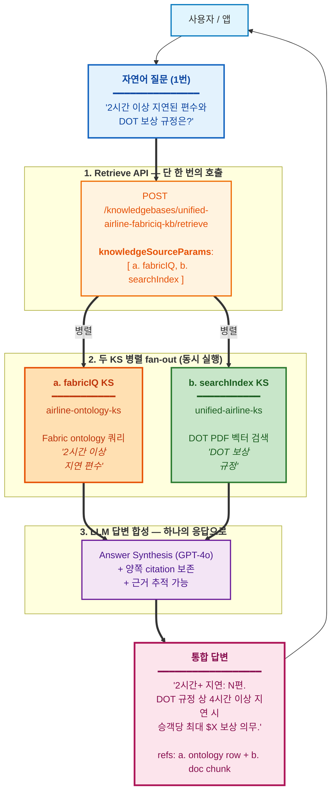

# Fabric IQ Ontology × Foundry IQ — 데모 팩

> **버전**: v1.0 — 2026-04-23 (Korea STU CAIP Hands-on)
> **공개 범위**: Microsoft 내부 (Korea GBB 채널)
> **작성**: Hyeonsang Jeon — Global Black Belt, AI Apps Sr. Solution Engineer (`hjeon@microsoft.com`)

**목적**: Korea STU CAIP Hands-on (4/23) — Microsoft Fabric ontology를 **두 가지 경로**로 질의하는 라이브 데모. (1) Fabric IQ MCP 엔드포인트 직접 호출 (Layer 1), (2) Foundry IQ Retrieve API + `kind: fabricIQ` Knowledge Source 경유 (Layer 2).

**대상**: Korea STU 실무자, 참관자

**형식**: 라이브 화면 공유 데모. 참석자는 우리 테넌트에 직접 호출하지 않음.

> 영문 원본: [README.md](./README.md)
> 상세 가이드 (한국어): [`../guide-ko.md`](../guide-ko.md)

---

## 무엇을 보여주는가

같은 Fabric ontology 데이터에 닿는 **두 가지 길**을 나란히 놓고 비교하는 데모다.

- **Layer 1 — MCP 직접 호출** (`scripts/demo_01~06`): Fabric IQ Ontology MCP 엔드포인트에 곧장 JSON-RPC POST를 던지는 방식. tool은 두 개 (`list_ontology_entity_types`, `search_ontology`)뿐이라 가장 단순하다.
- **Layer 2 — Foundry IQ KS 경로** (`scripts/demo_07~11`): 같은 질문에 *"airline ontology"* 라는 한 마디만 덧붙여 Foundry IQ Retrieve API로 보낸다. KB `unified-airline-fabriciq-kb`에는 fabricIQ KS와 searchIndex KS가 **둘 다** 등록돼 있지만, 이 한 마디 덕분에 planner가 ontology 안에서만 답을 찾는다. 결과적으로 행 수는 Layer 1과 똑같이 5 / 15 / 10 / 30 / 42로 떨어진다. 참고로 `knowledgeSourceParams`는 "이 KS만 써라"라는 강제가 아니라 "이 KS를 쓸 때는 이 옵션" 정도의 힌트다. 그래서 demo_12에서는 두 KS를 **명시적으로** 같이 호출해 Semantic JOIN을 보여준다.

이 팩에 포함된 것:

1. **`setup.sh`** — az login + 토큰 발급 헬퍼
2. **`lib/mcp_call.sh`** — JSON-RPC POST 래퍼 (Layer 1 — MCP 직접 호출)
3. **`lib/foundry_kb_call.sh`** — Foundry IQ Retrieve API 래퍼 (Layer 2 — KS 경로, OBO 토큰)
4. **`queries/*.json`** — 사전 검증된 6개 NL 질의
5. **`scripts/demo_01~06_*.sh`** — Layer 1 데모 (6개 패턴)
6. **`scripts/demo_07~11_*_via_kb.sh`** — Layer 2 데모 (5개 패턴, demo_02~06 미러링)
7. **`samples/*.json`** — OFFLINE replay용 캡처 응답 (Layer 2 fallback)
8. **`.env.example`** — 테넌트/워크스페이스/온톨로지 + AI Search KS 설정

---

## 아키텍처 노트

이 팩은 **같은 Fabric ontology를 두 가지 길로 부르는 모습**과, 거기에 PDF citation을 더해 한 답변으로 묶는 **cross-source killer demo**까지 함께 보여준다.

- **Layer 1** (demo_01~06): Fabric MCP 엔드포인트에 곧장 JSON-RPC over HTTPS로 붙는다. Private Preview 기간에는 가장 작고 안정적인 표면이다.
- **Layer 2** (demo_07~11): Azure AI Search의 **Foundry IQ Retrieve API**를 거친다. 등록된 Knowledge Source(kind: fabricIQ)가 같은 MSIT Fabric ontology로 federation 하기 때문에 데이터는 Layer 1과 똑같지만, 호출이 한 hop 더 길어진다. ontology + searchIndex / web KS를 같이 쓰는 멀티소스 에이전트가 실제 운영에서 따라가는 길이다.
- **Semantic JOIN** (demo_12): 같은 Retrieve API를 쓰되 **두 KS를 동시에** 호출한다 — fabricIQ + searchIndex. 질문 하나가 ontology 행과 정책 문서 passage를 모두 끌어오고, reasoning model이 그 둘을 한 답변으로 묶는다.


**다이어그램 보는 법**
- 세 경로 모두 같은 Microsoft 1P 표면을 쓰지만 진입 지점이 다르다. Layer 1은 Fabric에 곧장 붙고, Layer 2와 Semantic JOIN은 Azure AI Search를 한 번 거친다.
- KB `unified-airline-fabriciq-kb`에는 fabricIQ KS (ⓐ)와 searchIndex KS (ⓑ)가 **나란히** 등록돼 있다. `knowledgeSourceParams`는 KS별 **옵션 힌트**일 뿐 "이 KS만 써라"라는 잠금장치가 아니다 — planner(`modelQueryPlanning`)는 등록된 모든 KS를 후보로 두고 판단한다.
- **demo_07~11**은 `[{kind: "fabricIQ"}]`만 보내고 질문에 *"from our airline ontology"* 라는 힌트를 섞는다. 그러면 planner가 "이건 ontology에서 답이 나온다" 고 판단해 fabricIQ-only로 흘러가고, 행 수도 Layer 1과 그대로 (5 / 15 / 10 / 30 / 42) 맞는다. 만약 힌트를 빼고 그냥 *"list all airlines"* 라고 물으면 planner가 PDF 쪽 (ⓑ)도 같이 깨우는 경우가 흔하다 — 버그가 아니라 "PDF에서도 답이 나올 만하다" 고 판단한 정상 동작이다.
- **demo_12**는 `[{kind: "fabricIQ"}, {kind: "searchIndex"}]`를 **둘 다** 명시적으로 보내서 두 KS를 강제로 병렬 실행시킨다. 그 다음 reasoning model이 두 결과를 한 답변으로 묶고, 양쪽 출처의 citation을 함께 남긴다.

> Layer 1은 지금 Private Preview에서 가장 안전한 길이다 (Workspace Member만 있으면 된다). Layer 2는 테넌트 allowlisting이 끝나면 운영에서 실제로 쓰게 될 호출 형태고, Semantic JOIN (demo_12)은 거기에 멀티소스 융합까지 더한 형태다 — Foundry IQ 에이전트 대부분이 결국 사용하게 될 패턴이다.

---

## 사전 요건

- ontology 호스팅 테넌트(현재 Private Preview는 MSIT)에 로그인된 `az` CLI
- `jq` (JSON 정렬 출력용, 권장)
- 대상 Fabric 워크스페이스에 최소 Member 권한

토큰 스코프: `https://api.fabric.microsoft.com/.default`
토큰 수명: 약 1시간. setup 스크립트가 필요 시 재발급.

**Layer 2 데모용** (`demo_07~11`):
- AI Search admin/query key (`.env`의 `AZURE_SEARCH_API_KEY`)
- MSIT 테넌트 로그인: `az login --tenant 72f988bf-86f1-41af-91ab-2d7cd011db47`
- 토큰 스코프 (`foundry_kb_call.sh`가 자동 발급): `https://search.azure.com/.default`
- 위 항목 미충족 시 OFFLINE 샘플로 자동 fallback.

---

## 빠른 시작

```bash
cp .env.example .env
# .env 편집 — TENANT_ID, WORKSPACE_ID, ONTOLOGY_ID, MCP_HOST 설정
# (Layer 2 선택) AZURE_SEARCH_ENDPOINT, AZURE_SEARCH_API_KEY, KB_NAME, DEFAULT_KS_NAME

source ./setup.sh && set +e

# Layer 1 — MCP 직접 호출
./scripts/demo_01_entities.sh     # ontology schema 조회
./scripts/demo_02_airlines.sh     # 우리 airline ontology의 Airline 레지스트리
./scripts/demo_03_airports.sh     # 우리 airline ontology의 Airport 목록 (city 포함)
./scripts/demo_04_flights.sh      # 2-way JOIN — Flight ⮸ Airline (Flight.airline_id = Airline.airline_id)
./scripts/demo_05_fleet.sh        # 3-way JOIN — Aircraft ⮸ Manufacturer ⮸ Airline (Aircraft.manufacturer + Aircraft.airline_id → Airline.name)
./scripts/demo_06_delayed.sh      # 필터 쿼리 — Flight WHERE flight_status = 'Delayed' (Signal demo)

# Layer 2 — Foundry IQ KS 경로 (같은 데이터, 다른 경로)
./scripts/demo_07_airlines_via_kb.sh   # ↔ demo_02 비교
./scripts/demo_08_airports_via_kb.sh   # ↔ demo_03
./scripts/demo_09_flights_via_kb.sh    # ↔ demo_04
./scripts/demo_10_fleet_via_kb.sh      # ↔ demo_05
./scripts/demo_11_delayed_via_kb.sh    # ↔ demo_06
# Layer 2 ⭐ — Semantic JOIN (멀티 KS: fabricIQ + searchIndex)
./scripts/demo_12_semantic_join.sh     # 2시간+ 지연 편수 (fabricIQ) + DOT 보상 규정 (searchIndex) 융합 응답
# OFFLINE 모드 (캡처된 sample 사용 — 키/네트워크 없이 동작)
OFFLINE=1 ./scripts/demo_07_airlines_via_kb.sh
```

### 데모 인덱스

#### Layer 1 — MCP 직접 호출

| # | 스크립트 | 질의 | 기대 결과 |
|---|--------|-------|----------|
| 01 | `demo_01_entities.sh` | schema 조회 | 13 entities |
| 02 | `demo_02_airlines.sh` | "list all airlines from our airline ontology" | 항공사 5개 |
| 03 | `demo_03_airports.sh` | "list all airports from our airline ontology with their cities" | 공항 15개 |
| 04 | `demo_04_flights.sh` | "show 10 flights from our airline ontology with their flight numbers and operating airlines" | 항공편 10개, **2-way JOIN** — Flight ⮸ Airline (`Flight.airline_id` = `Airline.airline_id`), 결과에 `flight_number`, `airline_name` 함께 투영 |
| 05 | `demo_05_fleet.sh` | "list all aircraft from our airline ontology with their manufacturers and the airlines that operate them" | 항공기 30대, **3-way JOIN** — Aircraft ⮸ Manufacturer (Aircraft.manufacturer property) ⮸ Airline (`Aircraft.airline_id` = `Airline.airline_id`). 결과: `aircraft_id`, `manufacturer`, `airline_name` |
| 06 | `demo_06_delayed.sh` | "which flights from our airline ontology are currently in Delayed status" | 지연 42편 (Flight WHERE `flight_status = 'Delayed'`) |

#### Layer 2 — Foundry IQ KS 경로 (2026-04-22 추가)

같은 NL 질의를 운영 경로 (own-app → Azure AI Search → KB → KSes)로 흘려본다. KB에 KS가 둘 다 등록돼 있어도, 질문에 *"from our airline ontology"* 같은 한 마디만 섞으면 planner가 fabricIQ KS만 깨워서 Layer 1과 똑같은 행 수로 답한다 (5 / 15 / 10 / 30 / 42). activity log를 열어보면 fabricIQ-only로만 호출됐음이 그대로 보인다. 두 KS를 같이 쓰는 본격 멀티소스 융합은 demo_12에서 다룬다.

| # | 스크립트 | Layer 1 baseline | 기대 결과 (Layer 2) |
|---|--------|------------------|--------------------|
| 07 | `demo_07_airlines_via_kb.sh` | demo_02 → 항공사 5개 | 항공사 5개 (fabricIQ-only) |
| 08 | `demo_08_airports_via_kb.sh` | demo_03 → 공항 15개 | 공항 15개 (fabricIQ-only) |
| 09 | `demo_09_flights_via_kb.sh` | demo_04 → 항공편 10개 | 항공편 10개, 2-way JOIN (fabricIQ-only) |
| 10 | `demo_10_fleet_via_kb.sh` | demo_05 → 항공기 30대 | 항공기 30대, 3-way JOIN (fabricIQ-only) |
| 11 | `demo_11_delayed_via_kb.sh` | demo_06 → 지연 42편 | 지연 42편, Flight 필터 (fabricIQ-only) |

> **발표 흐름 팁**: demo_07~11에서 "힌트만 잘 넣으면 운영 경로에서도 ontology만 깔끔하게 답한다"를 먼저 보여주고, 이어서 *힌트를 빼고* `"list all airlines"` 같은 generic 질문으로 한 번 더 던져보세요. planner가 PDF 쪽도 같이 깨우는 모습이 활성 로그에 자연스럽게 잡히고, "필요하면 알아서 멀티소스로 퍼진다"는 흐름이 만들어집니다. 그 다음 demo_12로 넘어가 두 KS를 **명시적으로** 같이 호출하는 본격 Semantic JOIN을 보여주면 빌드업이 매끄럽게 이어집니다.

#### Layer 2 — Semantic JOIN (killer demo)

질문 하나가 **종류가 다른 두 KS로 동시에** 갈라진다. fabricIQ KS의 운영 데이터와 searchIndex KS의 규제 PDF가 한 답변에 함께 묶여 돌아온다.

| # | 스크립트 | KSes | 기대 결과 |
|---|--------|------|----------|
| 12 ⭐ | `demo_12_semantic_join.sh` | `airline-ontology-ks` (fabricIQ) + `unified-airline-ks` (searchIndex) | 2시간+ 지연 편수와 DOT 보상 규정을 묶은 통합 NL 답변. activity 로그에 두 KS가 모두 보이고, references에 fabricIQ raw 행과 searchIndex PDF citation이 함께 들어온다 |

**The Killer Demo — demo_12**

자연어 질문 한 번에 두 KS가 동시에 깨어난다.

- `airline-ontology-ks` (fabricIQ) → Fabric ontology에서 2시간+ 지연 편수를 집계한다 (`Flight WHERE delay_minutes > 120`)
- `unified-airline-ks` (searchIndex) → DOT 14 CFR Part 250 / Aviation Consumer Protection PDF에서 보상 조항을 찾아온다

돌아오는 답에는 운영 데이터의 "몇 편 지연됐다" 와 정책 문서의 "몇 시간 이상이면 얼마를 보상해야 한다" 가 한 문단으로 묶여 있고, 양쪽 출처의 citation이 나란히 붙는다. 흔히 말하는 **"Semantic JOIN"** 이 실제로 어떻게 생긴 건지 한눈에 보여주는 장면이다 — *질문 하나, 종류가 다른 KS 여러 개, 답변 하나*.



> **Layer 2 호출에 필요한 것** (online 모드):
> - `.env`에 `AZURE_SEARCH_ENDPOINT` / `AZURE_SEARCH_API_KEY` / `KB_NAME` / `DEFAULT_KS_NAME` 채워두기
> - MSIT 테넌트 로그인 (`az login --tenant 72f988bf-86f1-41af-91ab-2d7cd011db47`)
> - 둘 중 하나라도 없으면 `samples/0[7-9]_*.json` / `samples/1[01]_*.json` 캡처 응답으로 OFFLINE 자동 재생.
