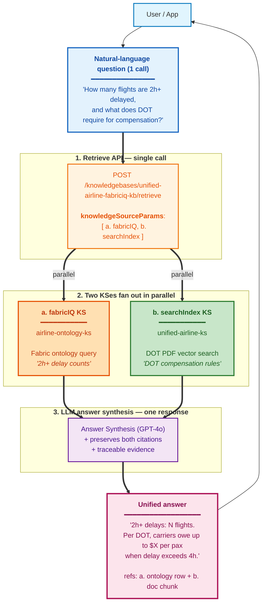

# Fabric IQ Ontology × Foundry IQ — Demo Pack

> **Version**: v1.0 — 2026-04-23 (Korea STU CAIP Hands-on)
> **Scope**: Microsoft internal (Korea GBB channel)
> **Author**: Hyeonsang Jeon — Global Black Belt, AI Apps Sr. Solution Engineer (`hjeon@microsoft.com`)

**Purpose**: Korea STU CAIP Hands-on (4/23) — live demonstration of querying a Microsoft Fabric ontology through **two paths**: Fabric IQ MCP endpoint directly (Layer 1), and Foundry IQ Retrieve API via `kind: fabricIQ` Knowledge Source (Layer 2).

**Audience**: Korea STU practitioners attendees, observers

**Format**: Live screen-share demo. Attendees do not execute against our tenant.

> 한국어 버전: [README.ko.md](./README.ko.md)
> Companion guide (Korean, deeper walkthrough): [`../guide-ko.md`](../guide-ko.md)

---

## What this shows

This pack puts **two paths to the same Fabric ontology data** side by side so you can compare them.

- **Layer 1 — MCP direct call** (`scripts/demo_01~06`): Plain JSON-RPC POST straight to the Fabric IQ Ontology MCP endpoint. Only two tools (`list_ontology_entity_types`, `search_ontology`) are exposed, so this is the simplest possible surface.
- **Layer 2 — Foundry IQ KS path** (`scripts/demo_07~11`): The same questions, but with one short hint — *"from our airline ontology"* — added to the prompt and routed through the Foundry IQ Retrieve API. The KB `unified-airline-fabriciq-kb` has both KSes registered (fabricIQ + searchIndex), but that hint is enough to keep the planner inside the ontology, so the row counts come back identical to Layer 1 (5 / 15 / 10 / 30 / 42). For context, `knowledgeSourceParams` is not a hard "use only this KS" lock — it is more like a "when you do use this KS, here are the options" hint. That is why demo_12 explicitly opts both KSes in to show off the killer Semantic JOIN.

This pack contains:

1. **`setup.sh`** — az login + token acquisition helper
2. **`lib/mcp_call.sh`** — JSON-RPC POST wrapper (Layer 1 — MCP direct call)
3. **`lib/foundry_kb_call.sh`** — Foundry IQ Retrieve API wrapper (Layer 2 — KS path with OBO token)
4. **`queries/*.json`** — 6 curated NL queries, pre-verified with data
5. **`scripts/demo_01~06_*.sh`** — Layer 1 demos (6 patterns)
6. **`scripts/demo_07~11_*_via_kb.sh`** — Layer 2 demos (5 patterns, mirrors demo_02~06)
7. **`samples/*.json`** — captured responses for OFFLINE replay (Layer 2 fallback)
8. **`.env.example`** — tenant/workspace/ontology + AI Search KS configuration

---

## Architecture note

This pack walks through **two ways of reaching the same Fabric ontology**, plus a **cross-source killer demo** that pairs the ontology with PDF citations in one answer.

- **Layer 1** (demo_01~06) hits the Fabric MCP endpoint **directly** over JSON-RPC. It is the smallest, most reliable surface during Private Preview.
- **Layer 2** (demo_07~11) goes through Azure AI Search's **Foundry IQ Retrieve API**. The registered Knowledge Source (kind: fabricIQ) federates back to the same MSIT Fabric ontology, so the data is identical to Layer 1 — there is just one extra hop. This is the path real multi-source agents follow when they combine ontology with searchIndex / web KSes.
- **Semantic JOIN** (demo_12) uses the same Retrieve API but calls **two KSes at once** — fabricIQ + searchIndex. A single question pulls both ontology rows and policy-document passages, and the reasoning model fuses them into one answer.


**How to read the diagram**
- All three rows hit the same Microsoft 1P surface area, but enter at different points. Layer 1 talks to Fabric directly; Layer 2 and Semantic JOIN go through Azure AI Search first.
- The KB `unified-airline-fabriciq-kb` has the fabricIQ KS (ⓐ) and the searchIndex KS (ⓑ) registered **side by side**. `knowledgeSourceParams` is a per-KS *option hint*, not an allow-list — the planner (`modelQueryPlanning`) still considers every registered KS as a candidate.
- **demo_07~11** pass `[{kind: "fabricIQ"}]` and add a small hint to the prompt — *"from our airline ontology"*. That hint tells the planner "this question can be answered from the structured ontology", so the activity log shows fabricIQ-only and the row counts match Layer 1 (5 / 15 / 10 / 30 / 42). Drop the hint and ask the unscoped *"list all airlines"* and the planner will often wake ⓑ (searchIndex) too, because PDF chunks plausibly answer it as well — that is realistic production behavior, not a bug.
- **demo_12** explicitly sends `[{kind: "fabricIQ"}, {kind: "searchIndex"}]` so both KSes are guaranteed to run in parallel. The reasoning model then merges both result sets into one answer and keeps citations from both backends.

> Layer 1 is the safest path during the current Private Preview (Workspace
> Member is enough — no extra allowlist needed). Layer 2 is the call shape
> you'll actually use in production once tenant allowlisting is done, and
> Semantic JOIN (demo_12) adds multi-source fusion on top of that — the
> pattern most real Foundry IQ agents will end up using.

---

## Prerequisites

- `az` CLI logged into the tenant that hosts the ontology (MSIT for the current Private Preview)
- `jq` for JSON pretty-printing (optional but recommended)
- Access to the target Fabric workspace as at least a Member

Token scope: `https://api.fabric.microsoft.com/.default`
Token lifetime: ~1 hour. The setup script re-acquires on demand.

**For Layer 2 demos** (`demo_07~11`):
- AI Search admin/query key (set in `.env` as `AZURE_SEARCH_API_KEY`)
- MSIT tenant login: `az login --tenant 72f988bf-86f1-41af-91ab-2d7cd011db47`
- Token scope (auto-issued by `foundry_kb_call.sh`): `https://search.azure.com/.default`
- Without these, demos fall back to OFFLINE samples automatically.

---

## Quick start

```bash
cp .env.example .env
# edit .env — set TENANT_ID, WORKSPACE_ID, ONTOLOGY_ID, MCP_HOST
# (optional, Layer 2) AZURE_SEARCH_ENDPOINT, AZURE_SEARCH_API_KEY, KB_NAME, DEFAULT_KS_NAME

source ./setup.sh && set +e

# Layer 1 — MCP direct call
./scripts/demo_01_entities.sh     # ontology schema lookup
./scripts/demo_02_airlines.sh     # airline registry in our operations dataset (Airline)
./scripts/demo_03_airports.sh     # airports from our airline ontology (Airport.city)
./scripts/demo_04_flights.sh      # 2-way JOIN — Flight ⮸ Airline (Flight.airline_id = Airline.airline_id)
./scripts/demo_05_fleet.sh        # 3-way JOIN — Aircraft ⮸ Manufacturer ⮸ Airline (Aircraft.manufacturer + Aircraft.airline_id → Airline.name)
./scripts/demo_06_delayed.sh      # filter query — Flight WHERE flight_status = 'Delayed' (Signal demo)

# Layer 2 — Foundry IQ KS path (same data, different path)
./scripts/demo_07_airlines_via_kb.sh   # ↔ mirrors demo_02
./scripts/demo_08_airports_via_kb.sh   # ↔ demo_03
./scripts/demo_09_flights_via_kb.sh    # ↔ demo_04
./scripts/demo_10_fleet_via_kb.sh      # ↔ demo_05
./scripts/demo_11_delayed_via_kb.sh    # ↔ demo_06

# Layer 2 ⭐ — Semantic JOIN (multi-KS: fabricIQ + searchIndex)
./scripts/demo_12_semantic_join.sh     # Delay counts at a specific airport (fabricIQ) + DOT compensation rules (searchIndex), fused

# OFFLINE mode (uses captured samples — works without keys/network)
OFFLINE=1 ./scripts/demo_07_airlines_via_kb.sh
```

### Demo Index

#### Layer 1 — MCP Direct Call

| # | Script | Query | Expected |
|---|--------|-------|----------|
| 01 | `demo_01_entities.sh` | schema lookup | 13 entities |
| 02 | `demo_02_airlines.sh` | "list all airlines from our airline ontology" | 5 airlines |
| 03 | `demo_03_airports.sh` | "list all airports from our airline ontology with their cities" | 15 airports |
| 04 | `demo_04_flights.sh` | "show 10 flights from our airline ontology with their flight numbers and operating airlines" | 10 flights, **2-way JOIN** — Flight ⮸ Airline (`Flight.airline_id` = `Airline.airline_id`), result projects `flight_number` + `airline_name` together |
| 05 | `demo_05_fleet.sh` | "list all aircraft from our airline ontology with their manufacturers and the airlines that operate them" | 30 aircraft, **3-way JOIN** — Aircraft ⮸ Manufacturer (Aircraft.manufacturer property) ⮸ Airline (`Aircraft.airline_id` = `Airline.airline_id`). Result: `aircraft_id`, `manufacturer`, `airline_name` |
| 06 | `demo_06_delayed.sh` | "which flights from our airline ontology are currently in Delayed status" | 42 delayed (Flight WHERE `flight_status = 'Delayed'`) |

#### Layer 2 — Foundry IQ KS Path (added 2026-04-22)

Same NL queries, but routed through the production path (own-app → Azure AI Search → KB → KSes). Even with both KSes registered on the KB, adding a small hint like *"from our airline ontology"* is enough for the planner to wake fabricIQ only, and the row counts come back identical to Layer 1 (5 / 15 / 10 / 30 / 42). The activity log makes this visible — fabricIQ-only execution, end to end. The full multi-KS fusion comes in demo_12.

| # | Script | Layer 1 baseline | Expected (Layer 2) |
|---|--------|------------------|--------------------|
| 07 | `demo_07_airlines_via_kb.sh` | demo_02 → 5 airlines | 5 airlines, fabricIQ-only |
| 08 | `demo_08_airports_via_kb.sh` | demo_03 → 15 airports | 15 airports, fabricIQ-only |
| 09 | `demo_09_flights_via_kb.sh` | demo_04 → 10 flights | 10 flights (2-way JOIN), fabricIQ-only |
| 10 | `demo_10_fleet_via_kb.sh` | demo_05 → 30 aircraft | 30 aircraft (3-way JOIN), fabricIQ-only |
| 11 | `demo_11_delayed_via_kb.sh` | demo_06 → 42 delayed | 42 delayed (Flight filter), fabricIQ-only |

> **Demo narrative tip**: Run demo_07~11 first to show that, with the right hint, even the production path stays clean and answers from the ontology only. Then drop the hint and re-ask *"list all airlines"* — the planner will likely also wake searchIndex, which lets you point at the activity log and say "and when the question warrants it, the system fans out across KSes on its own". From there, demo_12 lands naturally: we now **explicitly** ask both KSes at once for the full Semantic JOIN.

#### Layer 2 — Semantic JOIN (killer demo)

A single question fans out to **two KSes of different kinds at the same time** — operational data from the fabricIQ KS, regulatory PDF passages from the searchIndex KS — and comes back as one answer.

| # | Script | KSes | Expected |
|---|--------|------|----------|
| 12 ⭐ | `demo_12_semantic_join.sh` | `airline-ontology-ks` (fabricIQ) + `unified-airline-ks` (searchIndex) | One unified NL answer that combines 2h+ delay counts with DOT compensation rules. Activity log shows both KSes; references include both fabricIQ raw rows and searchIndex PDF citations |

**The Killer Demo — demo_12**

One natural-language question wakes both KSes at the same time:

- `airline-ontology-ks` (fabricIQ) → counts 2h+ delays from the Fabric ontology (`Flight WHERE delay_minutes > 120`)
- `unified-airline-ks` (searchIndex) → pulls compensation passages from DOT 14 CFR Part 250 / Aviation Consumer Protection PDFs

The answer that comes back ties together "how many flights were delayed" from operational data with "how much you owe per passenger past N hours" from the policy doc, and it carries citations from both sources side by side. That's what people actually mean when they say **"Semantic JOIN"** — *one question, several KSes of different kinds, one answer*.



> **What you need for Layer 2** (online mode):
> - Fill in `AZURE_SEARCH_ENDPOINT` / `AZURE_SEARCH_API_KEY` / `KB_NAME` / `DEFAULT_KS_NAME` in `.env`
> - Sign in to the MSIT tenant (`az login --tenant 72f988bf-86f1-41af-91ab-2d7cd011db47`)
> - If either is missing, the scripts automatically replay captured responses from `samples/0[7-9]_*.json` / `samples/1[01]_*.json` in OFFLINE mode.
