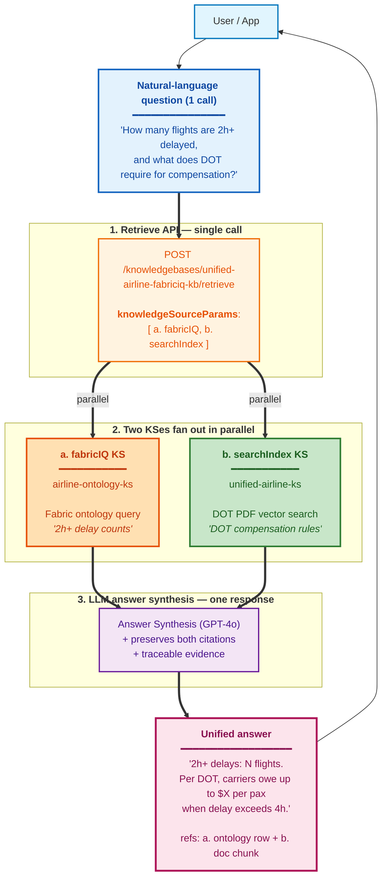

# Fabric IQ Ontology × Foundry IQ — Demo Pack

> **Version**: v1.0 — 2026-04-23 (Korea STU CAIP Hands-on)
> **Scope**: Microsoft internal (Korea GBB channel)
> **Author**: Hyeonsang Jeon — Global Black Belt, AI Apps Sr. Solution Engineer (`hjeon@microsoft.com`)

**Purpose**: Korea STU CAIP Hands-on (4/23) — live demonstration of querying a Microsoft Fabric ontology through **two paths**: Fabric IQ MCP endpoint directly (Layer 1), and Foundry IQ Retrieve API via `kind: fabricIQ` Knowledge Source (Layer 2).

**Audience**: Korea STU practitioners attendees, observers

**Format**: Live screen-share demo. Attendees do not execute against our tenant.

> 한국어 버전: [README.ko.md](./README.ko.md)
> Companion guide (Korean, deeper walkthrough): [`../guide-ko.md`](../guide-ko.md)

---

## What this shows

This pack demonstrates **two paths** to the same Fabric ontology data:

- **Layer 1 — MCP direct call** (`scripts/demo_01~06`): Raw JSON-RPC POST to the Fabric IQ Ontology MCP endpoint. Exposes two tools (`list_ontology_entity_types`, `search_ontology`).
- **Layer 2 — Foundry IQ KS path** (`scripts/demo_07~11`): The same NL queries (now scoped to *"our airline ontology"*) routed through the Foundry IQ Retrieve API on Azure AI Search. The KB `unified-airline-fabriciq-kb` has **both KSes registered** (fabricIQ + searchIndex), but the **scoping language signals the planner to stay inside the structured ontology**, so demo_07~11 row counts mirror Layer 1 (5 / 15 / 10 / 30 / 42). `knowledgeSourceParams` itself is a per-KS *override hint*, not an allow-list — demo_12 then **explicitly** opts both KSes in for the killer Semantic JOIN.

This pack contains:

1. **`setup.sh`** — az login + token acquisition helper
2. **`lib/mcp_call.sh`** — JSON-RPC POST wrapper (Layer 1 — MCP direct call)
3. **`lib/foundry_kb_call.sh`** — Foundry IQ Retrieve API wrapper (Layer 2 — KS path with OBO token)
4. **`queries/*.json`** — 6 curated NL queries, pre-verified with data
5. **`scripts/demo_01~06_*.sh`** — Layer 1 demos (6 patterns)
6. **`scripts/demo_07~11_*_via_kb.sh`** — Layer 2 demos (5 patterns, mirrors demo_02~06)
7. **`samples/*.json`** — captured responses for OFFLINE replay (Layer 2 fallback)
8. **`.env.example`** — tenant/workspace/ontology + AI Search KS configuration

---

## Architecture note

This pack supports **two paths to the same Fabric ontology**, plus a
**cross-source killer demo** that fuses ontology with PDF citations:

- **Layer 1** (demo_01~06) hits the Fabric MCP endpoint **directly** with
  JSON-RPC over HTTPS. Smallest, most reliable surface during Private Preview.
- **Layer 2** (demo_07~11) calls the **Foundry IQ Retrieve API** on Azure AI
  Search; the registered Knowledge Source (kind: fabricIQ) federates back to
  the same MSIT Fabric ontology, so the data is identical to Layer 1 but the
  request goes through one extra hop. This is the production path for
  multi-source agents that combine ontology with searchIndex / web KSes.
- **Semantic JOIN** (demo_12) calls the same Retrieve API with **two KSes at
  once** — fabricIQ + searchIndex — so a single NL question pulls structured
  ontology rows AND policy-document passages, fused by the reasoning model.


**Reading the diagram**
- All three rows hit the same Microsoft 1P surface area. Layer 1 talks to Fabric directly; Layer 2 + Semantic JOIN go through Azure AI Search.
- The KB `unified-airline-fabriciq-kb` has **two KSes registered side by side** (ⓐ + ⓑ). `knowledgeSourceParams` is a **per-KS override hint**, not an allow-list — the planner (`modelQueryPlanning`) considers all registered KSes.
- **demo_07~11** pass `[{kind: "fabricIQ"}]` and use **scoped phrasing** (*"from our airline ontology"*). That scoping signals the planner to satisfy the question from the structured ontology, so the activity log shows fabricIQ-only and row counts match Layer 1 (5 / 15 / 10 / 30 / 42). If you swap the prompt for an unscoped *"list all airlines"*, the planner will often **also** wake ⓑ (searchIndex) because PDF chunks plausibly answer it too — that is realistic production behavior, not a bug.
- **demo_12** explicitly passes `[{kind: "fabricIQ"}, {kind: "searchIndex"}]` so both KSes are guaranteed to run in parallel and the reasoning model fuses both result sets into one NL answer with citations from both backends.

> Layer 1 is the most reliable path during the current Private Preview
> (no allowlist required beyond Workspace Member). Layer 2 is the
> production-shaped call once tenant allowlisting completes. Semantic JOIN
> (demo_12) is the production-shaped call **plus** multi-source fusion —
> the pattern most real Foundry IQ agents will use.

---

## Prerequisites

- `az` CLI logged into the tenant that hosts the ontology (MSIT for the current Private Preview)
- `jq` for JSON pretty-printing (optional but recommended)
- Access to the target Fabric workspace as at least a Member

Token scope: `https://api.fabric.microsoft.com/.default`
Token lifetime: ~1 hour. The setup script re-acquires on demand.

**For Layer 2 demos** (`demo_07~11`):
- AI Search admin/query key (set in `.env` as `AZURE_SEARCH_API_KEY`)
- MSIT tenant login: `az login --tenant 72f988bf-86f1-41af-91ab-2d7cd011db47`
- Token scope (auto-issued by `foundry_kb_call.sh`): `https://search.azure.com/.default`
- Without these, demos fall back to OFFLINE samples automatically.

---

## Quick start

```bash
cp .env.example .env
# edit .env — set TENANT_ID, WORKSPACE_ID, ONTOLOGY_ID, MCP_HOST
# (optional, Layer 2) AZURE_SEARCH_ENDPOINT, AZURE_SEARCH_API_KEY, KB_NAME, DEFAULT_KS_NAME

source ./setup.sh && set +e

# Layer 1 — MCP direct call
./scripts/demo_01_entities.sh     # ontology schema lookup
./scripts/demo_02_airlines.sh     # airline registry in our operations dataset (Airline)
./scripts/demo_03_airports.sh     # airports from our airline ontology (Airport.city)
./scripts/demo_04_flights.sh      # 2-way JOIN — Flight ⮸ Airline (Flight.airline_id = Airline.airline_id)
./scripts/demo_05_fleet.sh        # 3-way JOIN — Aircraft ⮸ Manufacturer ⮸ Airline (Aircraft.manufacturer + Aircraft.airline_id → Airline.name)
./scripts/demo_06_delayed.sh      # filter query — Flight WHERE flight_status = 'Delayed' (Signal demo)

# Layer 2 — Foundry IQ KS path (same data, different path)
./scripts/demo_07_airlines_via_kb.sh   # ↔ mirrors demo_02
./scripts/demo_08_airports_via_kb.sh   # ↔ demo_03
./scripts/demo_09_flights_via_kb.sh    # ↔ demo_04
./scripts/demo_10_fleet_via_kb.sh      # ↔ demo_05
./scripts/demo_11_delayed_via_kb.sh    # ↔ demo_06

# Layer 2 ⭐ — Semantic JOIN (multi-KS: fabricIQ + searchIndex)
./scripts/demo_12_semantic_join.sh     # Delay counts at a specific airport (fabricIQ) + DOT compensation rules (searchIndex), fused

# OFFLINE mode (uses captured samples — works without keys/network)
OFFLINE=1 ./scripts/demo_07_airlines_via_kb.sh
```

### Demo Index

#### Layer 1 — MCP Direct Call

| # | Script | Query | Expected |
|---|--------|-------|----------|
| 01 | `demo_01_entities.sh` | schema lookup | 13 entities |
| 02 | `demo_02_airlines.sh` | "list all airlines from our airline ontology" | 5 airlines |
| 03 | `demo_03_airports.sh` | "list all airports from our airline ontology with their cities" | 15 airports |
| 04 | `demo_04_flights.sh` | "show 10 flights from our airline ontology with their flight numbers and operating airlines" | 10 flights, **2-way JOIN** — Flight ⮸ Airline (`Flight.airline_id` = `Airline.airline_id`), result projects `flight_number` + `airline_name` together |
| 05 | `demo_05_fleet.sh` | "list all aircraft from our airline ontology with their manufacturers and the airlines that operate them" | 30 aircraft, **3-way JOIN** — Aircraft ⮸ Manufacturer (Aircraft.manufacturer property) ⮸ Airline (`Aircraft.airline_id` = `Airline.airline_id`). Result: `aircraft_id`, `manufacturer`, `airline_name` |
| 06 | `demo_06_delayed.sh` | "which flights from our airline ontology are currently in Delayed status" | 42 delayed (Flight WHERE `flight_status = 'Delayed'`) |

#### Layer 2 — Foundry IQ KS Path (added 2026-04-22)

Same NL queries (scoped to *our airline ontology*) routed through the production path (own-app → Azure AI Search → KB → KSes). The scoping holds the planner inside the fabricIQ KS, so row counts mirror Layer 1 1:1. The activity log confirms fabricIQ-only execution. demo_12 is where we **explicitly** opt both KSes in for the killer Semantic JOIN.

| # | Script | Layer 1 baseline | Expected (Layer 2) |
|---|--------|------------------|--------------------|
| 07 | `demo_07_airlines_via_kb.sh` | demo_02 → 5 airlines | 5 airlines, fabricIQ-only |
| 08 | `demo_08_airports_via_kb.sh` | demo_03 → 15 airports | 15 airports, fabricIQ-only |
| 09 | `demo_09_flights_via_kb.sh` | demo_04 → 10 flights | 10 flights (2-way JOIN), fabricIQ-only |
| 10 | `demo_10_fleet_via_kb.sh` | demo_05 → 30 aircraft | 30 aircraft (3-way JOIN), fabricIQ-only |
| 11 | `demo_11_delayed_via_kb.sh` | demo_06 → 42 delayed | 42 delayed (Flight filter), fabricIQ-only |

> **Demo narrative tip**: After running demo_07~11 (clean fabricIQ-only mirror of Layer 1), drop the scoping and re-ask *"list all airlines"* to show that the planner now ALSO wakes searchIndex — evidence that the operating model can naturally fan out across KSes when the question warrants it. Then move to demo_12, where we **explicitly** force the multi-KS path for guaranteed semantic JOIN.

#### Layer 2 — Semantic JOIN (killer demo)

A single NL query is **routed to two KSes of different kinds in parallel** — Foundry IQ fuses the operational data from the fabricIQ KS with the regulatory PDF passages from the searchIndex KS into one answer.

| # | Script | KSes | Expected |
|---|--------|------|----------|
| 12 ⭐ | `demo_12_semantic_join.sh` | `airline-ontology-ks` (fabricIQ) + `unified-airline-ks` (searchIndex) | Unified NL answer covering 2h+ delay counts at a specific airport + DOT compensation rules; activity shows both KSes; references include both fabricIQ raw rows and searchIndex PDF citations |

**The Killer Demo — demo_12**

Single natural language question invokes both KSes in parallel:

- `airline-ontology-ks` (fabricIQ) → queries the Fabric ontology for delay counts at a specific airport (`Flight WHERE delay_minutes > 120`; airport configured in `demo_12_semantic_join.sh`)
- `unified-airline-ks` (searchIndex) → retrieves DOT 14 CFR Part 250 / Aviation Consumer Protection PDF passages on compensation

Response synthesizes the structured count **and** the policy text into one answer, with citations from both sources side by side. This is what **"Semantic JOIN"** means in practice: *one query, multiple KSes of different kinds, unified answer*.



> **Layer 2 prerequisites** (for online calls):
> - Set `AZURE_SEARCH_ENDPOINT` / `AZURE_SEARCH_API_KEY` / `KB_NAME` / `DEFAULT_KS_NAME` in `.env`
> - MSIT tenant login (`az login --tenant 72f988bf-86f1-41af-91ab-2d7cd011db47`)
> - If either is missing, scripts automatically fall back to OFFLINE samples under `samples/0[7-9]_*.json` / `samples/1[01]_*.json`
